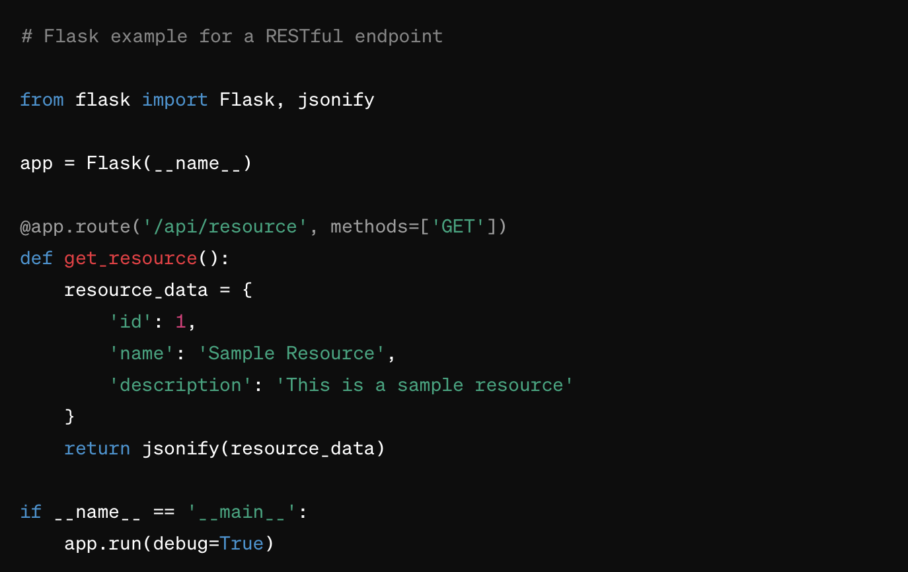

# Title
RESTful API
## Context
The current API lacks a consistent and standardized interface, leading to difficulties in consumption and integration by clients. There is a need for a well-defined and scalable API that follows RESTful principles to enhance usability and maintainability.

## Decision
To implement a RESTful API that adheres to the principles of Representational State Transfer (REST), providing a standardized and intuitive interface for client-server communication.

## Rationale
Scalability: RESTful APIs are inherently scalable due to their stateless nature, making it easier to handle a growing number of clients and increased demand.
Standardization: RESTful principles provide a standardized approach to API design, making it easier for developers to understand and consume the API. This consistency promotes better collaboration and reduces the learning curve.
Statelessness: By maintaining statelessness, the API becomes more resilient to failures and can easily recover from errors without affecting ongoing operations.
HTTP Methods: Utilizing standard HTTP methods (GET, POST, PUT, DELETE) simplifies interaction and conforms to well-established practices, enhancing the predictability of API behavior.
Resource-Based: Designing the API around resources and their representations promotes a clear and logical structure, improving the overall organization of endpoints and data.

## Consequences
Pros
Usability: Clients will find it easier to understand and interact with the API, leading to improved usability.
Scalability: The stateless nature of RESTful design facilitates scalability, ensuring the API can handle increased loads efficiently.
Interoperability: Following RESTful principles enhances interoperability, allowing the API to be consumed by a variety of clients and platforms.
Cons
Complexity: Implementing a RESTful API might introduce additional complexity, especially in scenarios where adherence to strict REST principles is challenging.
Learning Curve: Developers unfamiliar with RESTful principles may experience a learning curve, although the long-term benefits in clarity and standardization can outweigh this.

## Sample code
Give some sample code related to this decision.

